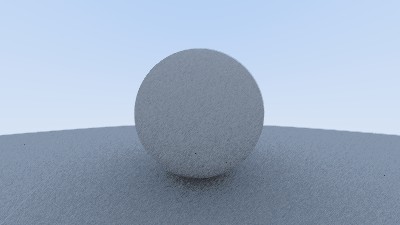
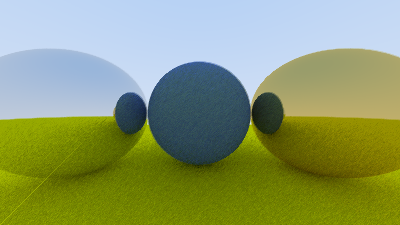
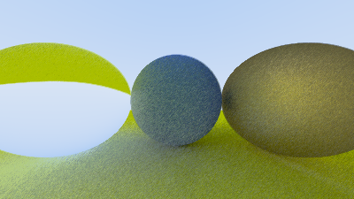
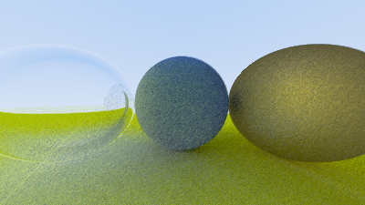

# Ray Tracing project

## work in progress

## Summary
Hi, my name is Jaeden and I am a computer science graduate from the University of central Florida.
This project is simply me working on some computer graphics stuff for fun. The goal is to build 
a ray tracer through webGL. My steps through it are to understand the process through accomplishing
this in a 2D space because of the smaller complexity before my attempt towards a 3D space.  

Things I have experimented with in a 2D space were casting out rays as well as math for calculating the
soft shadows from multiple light sources.

## Able to render multiple spheres and calculate their normals

## By using random numbers to create noise I was able to implement anti-aliasing through pixel sampling which smooths out the sphere

Some sources on how to generate random numbers due to the fact that glsl does not support 
built in random number generation

Some sources that I used to learn:

https://patriciogonzalezvivo.com/

https://thebookofshaders.com/10/

https://byteblacksmith.com/improvements-to-the-canonical-one-liner-glsl-rand-for-opengl-es-2-0/

## instead of normals the color is based on the attenuation value that decreases when a ray bounces more

A small thing to note is I have made a transition from using traditional sampling to a progressiver rendering technique to save on performance due to the limitations of my computers gpu.

The image below is the traditional approach that takes a long time to render and still has issues with shadow acne and noticable noise. The smaller image with gamma corrected color is progressively rendered and has shadow acne removed and is quite accurate to the guided tautorial book example that is quicker to render.

## lambertian sphere 

## lambertian sphere between 2 metallic spheres

## dielectric sphere where refractions invert view of the world

## turned glass sphere into a hollow glass sphere

## To install just copy the repo then install the dependencies:

`npm install`
then
`npm run dev`
when within the application directory {/Ray Tracing/rayTrace$}.

## Or if you want to see it run on your computer. May take a couple of minutes for the site to start up.
# (WARNING ray-tracing is expensive and requires a strong GPU. I am planning in the future to have settings for adjustability)
[Click Here](https://ray-trace.onrender.com/)
